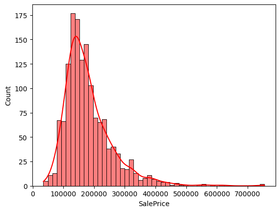

# 🏠 House Price Prediction Project

This repository showcases an end-to-end machine learning project analyzing the **House Pricing Dataset**. The aim is to predict house prices based on various features such as location, size, and other property-related factors. 

---

## 🎨 **Project Overview** 

In this project, we:
1. Explored and visualized the dataset to understand trends and patterns.
2. Performed data preprocessing (handling missing values, encoding categorical features, etc.).
3. Built and evaluated multiple regression models:
   - Linear Regression
   - Decision Tree Regressor
   - XGBoost Regressor
4. Fine-tuned the models using GridSearchCV to optimize hyperparameters.
5. Generated final predictions and prepared a submission for a Kaggle competition.

---

## 📂 **Dataset**

The dataset includes two files:
- `train.csv` - Training data with house features and prices.
- `test.csv` - Testing data without house prices (used for predictions).

### 🚀 **Dataset Features**
- **Numerical features**: Lot area, year built, living area, etc.
- **Categorical features**: Neighborhood, building type, etc.
- **Target**: Sale Price (in USD).

---

## **Analysis Workflow**

### **1. Exploratory Data Analysis (EDA)**

We began by examining the dataset:
- Visualized missing values using a heatmap.
- Studied the distribution of the target variable (`SalePrice`) before and after log transformation.
- Explored relationships between categorical features and `SalePrice` using bar plots.

🌟 Key Insights:
- Features like `MSZoning`, `BldgType`, and `Street` show significant variation in average sale prices.
- Log transformation helped normalize the skewed `SalePrice` distribution.

**Visualization Example**: 
### Heatmap of Missing Values:

### Sale Price Distribution (Log Scaled):

### Average Sale Price by Building Type:

---

### **2. Data Preprocessing**

Steps taken:
1. Dropped irrelevant or redundant columns (e.g., `Id`, `Fireplaces`, `Alley`).
2. Imputed missing values:
   - Numerical features: Replaced with mean.
   - Categorical features: Replaced with mode.
3. Encoded categorical variables using `OneHotEncoder`.
4. Standardized numerical features for better model performance.

---

### **3. Model Building and Evaluation**

#### **Models Trained**:
1. **Linear Regression**
   - Baseline model with minimal tuning.
   - Performance Metric: Root Mean Squared Log Error (RMSLE).
   - Observed Overfitting in baseline results.
   
2. **Decision Tree Regressor**
   - Tuned using GridSearchCV to find optimal depth and splitting criteria.
   - Best RMSLE achieved: `41012.66`.

3. **XGBoost Regressor**
   - Tuned hyperparameters (`max_depth`, `n_estimators`, `learning_rate`).
   - Best RMSLE achieved: `27507.04`.

**Final Prediction**:
We combined predictions from Linear Regression and XGBoost Regressor for a weighted ensemble, achieving better performance.

---

## **Results**

| **Model**                | **Best Parameters**             | **RMSLE**   |
|--------------------------|----------------------------------|-------------|
| Linear Regression         | N/A                            | `not defined`     |
| Decision Tree Regressor   | {'model__max_depth': 20, 'model__min_samples_leaf': 4, 'model__min_samples_split': 10}       | `41012.66`     |
| XGBoost Regressor         | {'model__learning_rate': 0.1, 'model__max_depth': 3, 'model__n_estimators': 200}        | `27507.04`     |

